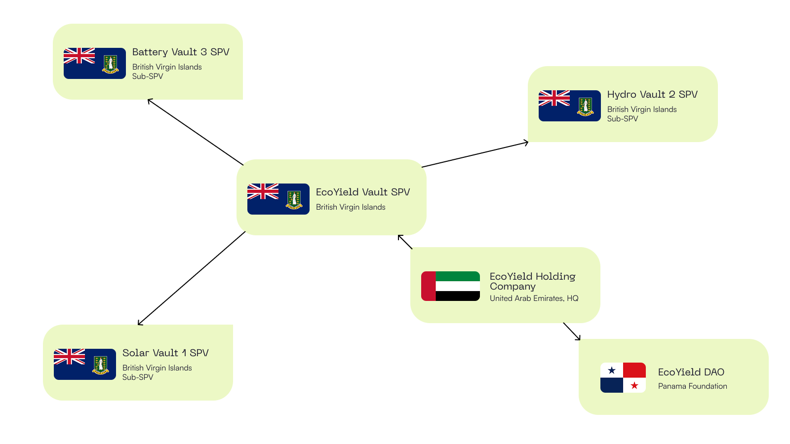

# Entity Structure

EcoYield is built on a multi-jurisdictional legal stack designed to balance compliance, operational efficiency, and investor confidence. This structure ensures that the protocol can scale globally while remaining aligned with regulatory expectations in key markets.

<figure><figcaption></figcaption></figure>

## 1. Panama Foundation (DAO Layer)

* Functions as the governance and protocol foundation.
* Holds intellectual property (IP), protocol rights, and oversees the decentralised governance framework.
* Provides a compliant legal wrapper for DAO activity, ensuring enforceability and liability protection.
* Enables flexible governance participation under global frameworks, while maintaining light KYC/AML access to yield vaults.

## 2. BVI SPV (Funding & Asset Vehicle)

* Structured as a Special Purpose Vehicle in the British Virgin Islands.
* Manages investor fundraising (private rounds, presales) and allocation into project vaults.
* Acts as the contractual bridge between on-chain tokenised assets and real-world energy + compute infrastructure.
* Ensures clean separation of fundraising activity and treasury operations from protocol governance.

## 3. UAE Headquarters (Operational Hub)

* Serves as the primary operating entity, coordinating engineering, deployment, and commercial activities.
* Manages local project execution for flagship deployments in the UAE and wider GCC.
* Provides direct oversight of development partners, EPC contractors, and renewable asset owners.
* Anchors EcoYield in a global hub for renewable energy and AI infrastructure investment.

## Why This Matters

* Credibility: A legally robust, multi-entity structure reassures both investors and regulators.
* Scalability: Each entity plays a specialised role; governance (Panama), fundraising (BVI), execution (UAE).
* Compliance First: Aligns EcoYield with MiCA, FATF, and regional frameworks while maintaining global accessibility.
* Risk Management: Ring-fences legal, financial, and operational risk at different layers of the stack.

This structure ensures EcoYield is not just another crypto experiment but a compliant, investable, and operationally sound platform for building the future of clean AI infrastructure.
